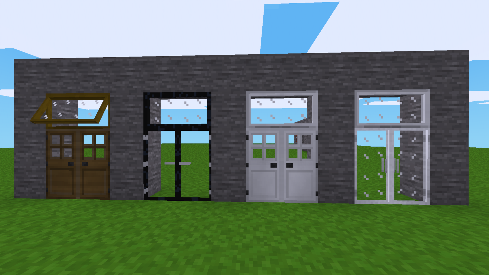
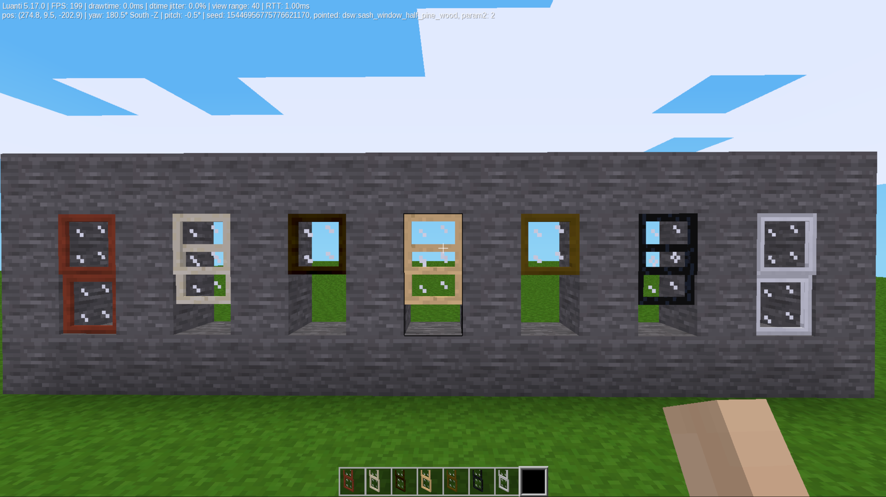

# [Mod]Over Door Windows [over_door_windows] — Modpack

This modpack adds functional single, double windows designed to sit perfectly above your doors,
double sash windows, and low sash windows.

## Features
* **Perfect Alignment:** odw windows sit directly above your door frames.
* **Single & Double Options:** Fits standard 1-block wide doors and wide double-doors.
* **Double Sash Windows:** Adds elegant, functional sash-style options.
* **Low Sash Windows:** Adds functional low sash windows, which place onto slabs.

## Installation
1. Download the modpack archive.
2. Extract the folder into your Luanti `mods/` directory.
3. Make sure the main folder is named exactly `over_door_windows`.
4. Enable the modpack in your world configuration menu.

*Note: For individual sub-component details, please check the specific license files inside the mod subfolders.*

