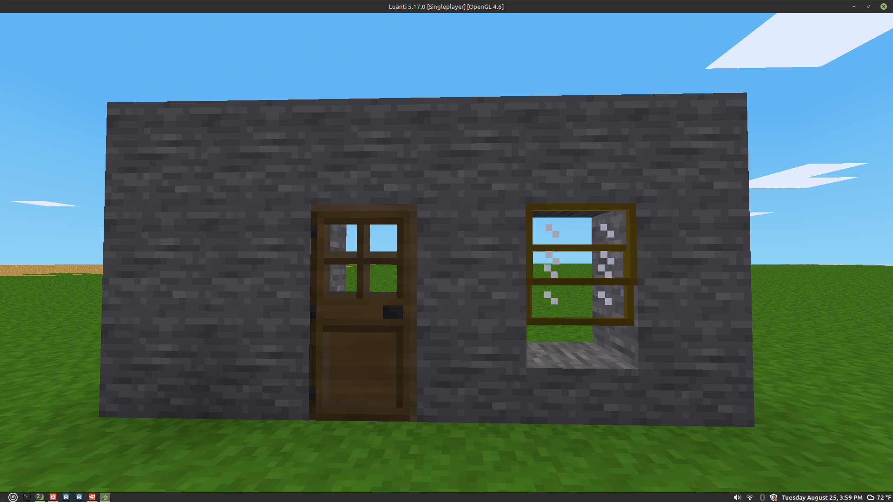
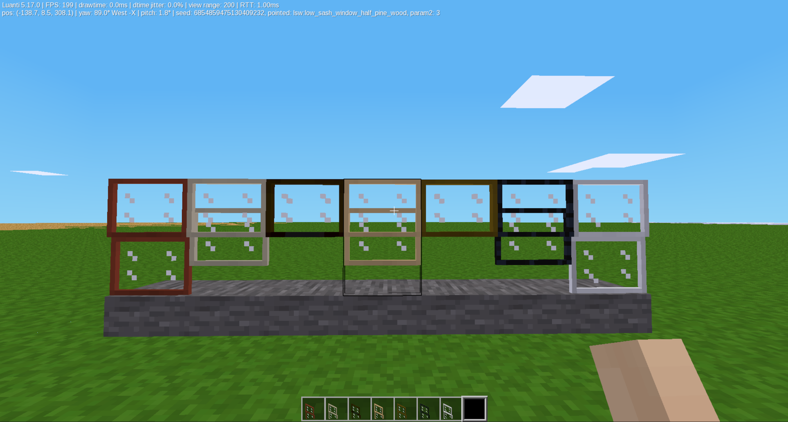

# [Mod]Low Sash Windows [lsw] [2026-08-24]

This mod adds functional double low sash windows, which place onto slabs,
designed to add a realistic and elegant feel to your builds.

## Features
* **Adds elegant low sash windows.**
* *1 right-click opens to half, 2 right-click full open, 3 right-click closes the window.*
* **Aligns perfectly with standard door frames.**
* **All wood types, plus obsidian & steel versions.**

## License
* **Code:** MIT (Copyright 2015-2016 TumeniNodes)
* **Media:** CC-BY-SA 4.0 (Copyright 2015-2016 TumeniNodes)

